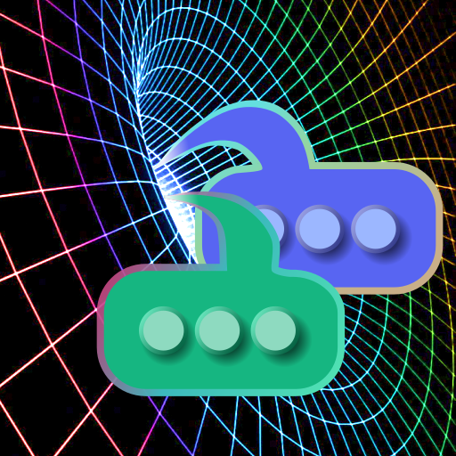

# Out Of Your Element

Modern Matrix-to-Discord appservice bridge, created by [@cadence:cadence.moe](https://matrix.to/#/@cadence:cadence.moe)

 

## Why a new bridge?

* Modern: Supports new Discord features like replies, threads and stickers, and new Matrix features like edits, spaces and space membership.
* Efficient: Special attention has been given to memory usage, database indexes, disk footprint, runtime algorithms, and queries to the homeserver. [Efficiency details.](https://gitdab.com/cadence/out-of-your-element/src/branch/main/docs/developer-orientation.md)
* Reliable: Any errors on either side are notified on Matrix and can be retried. Messages sent during bridge downtime will still be bridged after it comes back up.
* Tested: A test suite and code coverage make sure all the logic and special cases work.
* Simple development: No build step (it's JavaScript, not TypeScript), minimal/lightweight dependencies, and abstraction only where necessary so that less background knowledge is required. No need to learn about Intents or library functions.
* No locking algorithm: Other bridges use a locking algorithm which is a source of frequent bugs. This bridge avoids the need for one.
* Latest API: Being on the latest Discord API version lets it access all features, without the risk of deprecated API versions being removed.

## What works?

Most features you'd expect in both directions: messages, edits, deletions, formatting (including spoilers), reactions, custom emojis, custom emoji reactions, mentions, channel mentions, replies, threads, stickers (all formats: PNG, APNG, GIF, Lottie), attachments, spoiler attachments (compatible with most clients), embeds, URL previews, presence, discord.com hyperlinks, and more.

Metadata is also synced: people's names, avatars, usernames; channel names, icons, topics; spaces containing rooms; custom emoji lists. Syncing Matrix rooms, room icons, and topics is optional: you can keep them different from the Discord ones if you prefer.

I've also added some interesting features that I haven't seen in any other bridge:

* Members using the PluralKit bot each get their own persistent accounts
* Replies from PluralKit members are restyled into native Matrix replies
* Simulated user accounts are named @the_persons_username rather than @112233445566778899
* Matrix custom emojis from private rooms are still visible on Discord as a sprite sheet
* To save space, larger files from Discord are linked instead of reuploaded to Matrix (links don't expire)

For more information about features, [see the user guide.](https://gitdab.com/cadence/out-of-your-element/src/branch/main/docs/user-guide.md)

## Caveats

* This bridge is not designed for puppetting.
* Direct Messaging is not supported until I figure out a good way of doing it.

## Get started!

[Read the installation instructions →](https://gitdab.com/cadence/out-of-your-element/src/branch/main/docs/get-started.md)
